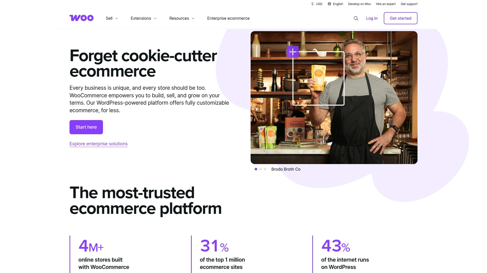

# 2025年排名前28的订阅电商平台汇总(最新整理)

传统电商单次交易模式难以保证稳定现金流,订阅模式能让商家获得可预测收入、提升客户终身价值。无论经营实物订阅盒、数字内容还是会员服务,选对平台可大幅降低运营成本、简化订购管理、减少客户流失。本文整理全球主流订阅电商解决方案,涵盖不同规模商家需求,帮助你快速找到适合自身业务场景的工具。

## **[Cratejoy](https://www.cratejoy.com)**

订阅盒商家首选的一体化市场与建站平台

Cratejoy创立于2014年,专为订阅盒业务设计,既是面向消费者的在线市场,也是为商家提供建站、支付、订单管理的完整解决方案。平台聚集海量垂直品类订阅盒(美妆、书籍、手工艺品、食品等),商家无需额外营销预算即可借助市场流量获得初始客户。

内置网站构建器支持零代码搭建品牌独立站,集成自动化邮件营销、推荐奖励计划、一次性产品加售、库存管理等功能。采用Level-1 PCI合规支付安全标准,全程SSL加密保护客户数据。定价从月费59美元起,另收1.25%+0.10美元交易手续费,适合希望快速测试市场、利用现成流量池的订阅盒创业者。

相比其他平台,Cratejoy的市场属性让新商家能在众多竞品中被消费者发现,降低冷启动难度;同时提供丰富教程文档和社区支持,帮助非技术背景创始人快速上手。

***

## **[Subbly](https://www.subbly.co)**

订阅业务优先设计的全栈电商系统

Subbly是市场上唯一专为订阅业务从零构建的原生平台,提供超过100项订阅专属功能,无需插件或编码技能。支持实物产品、数字下载、在线课程等多种订阅类型,内置拖拽式网站构建器、专业模板、自定义结账流程、分层定价方案、中途追加销售等高级功能。

兼容Stripe、Braintree、PayPal等主流支付网关,提供24/7真人客服支持和庞大的用户社区。定价从月费29美元起另加1.25%交易费,提供免费试用。平台持续根据订阅商家反馈迭代功能,特别适合需要灵活定制订阅规则、重视客户留存工具的成长型企业。

其订阅优先架构意味着所有功能围绕循环计费、客户保留、流失预防设计,避免传统电商平台通过插件拼凑订阅能力导致的系统臃肿和兼容性问题。

***

## **[Recharge](https://getrecharge.com)**

Shopify生态最受欢迎的订阅管理应用

Recharge是Shopify商家启用订阅功能的行业标准解决方案,将一次性产品轻松转换为订阅选项。支持基础订阅、动态捆绑包、分层折扣、无代码客户自助门户等高级功能。平台提供详尽的分析仪表板追踪流失率、客户终身价值、循环收入等关键指标。

深度集成Shopify Plus,经过官方Plus认证,构建在企业级基础设施上。客户可通过自助门户随时暂停、跳过、更换订阅,减少客服工作量。定价根据订阅规模浮动,中小商家可从较低月费起步。

Recharge拥有成熟的数据分析和流失预警机制,帮助商家在客户取消前采取保留措施。其庞大的第三方集成生态系统可与主流邮件营销、CRM、分析工具无缝对接。

***

## **[Bold Subscriptions](https://boldcommerce.com)**

功能强大的Shopify原生订阅插件

Bold Subscriptions是首个获得Shopify Plus官方认证的订阅应用,专为大规模商家设计。安装后60秒内即可启动订阅功能,提供直观的用户界面和自定义订阅表单。内置9项"Maximizers"增收工具,可在订阅者旅程各阶段进行追加销售和交叉销售,最大化客户生命周期价值。

平台保持99.98%在线率,稳定性行业领先。提供免费白手套迁移服务,加拿大本土资深支持团队随时响应。所有计划均可访问完整功能和API,标准版月费99美元另加1.25%和19美分交易费,专业版499美元另加1%和19美分交易费。

Bold允许商家给订阅产品打标签便于推广,创建符合网站主题的自定义订阅表单,通过详细分析仪表板识别客户群组趋势和潜在问题。

***

## **[Chargebee](https://www.chargebee.com)**

适合复杂计费场景的订阅管理系统

Chargebee专注自动化循环计费,特别擅长处理混合收入模型(订阅+一次性购买)。平台灵活配置客户和订阅计划,与Stripe、PayPal等支付网关无缝集成。支持全球税务合规、多种定价模型、智能催款管理、拒付自动化处理。

提供实时账单、泄漏、交易分析,支持自定义MRR估算和报表导出,无需开发人员即可追踪各类销售指标。定价根据业务规模定制,适合需要自动化发票、客户通知、复杂订阅生命周期管理的中大型企业。

Chargebee的强大之处在于处理多币种、跨地区税务、分层定价的能力,但对小型企业可能功能过于复杂。其分析和报告功能帮助企业深入了解订阅运营健康状况。

---

## **[PayWhirl](https://paywhirl.com)**

专为中小商家设计的轻量级订阅工具

PayWhirl提供简洁易用的订阅管理界面,特别适合希望快速启动订阅业务的小型团队。支持灵活计费周期、客户自助门户、自动化续订提醒、折扣码管理等核心功能。与主流电商平台和支付处理器兼容,设置过程简单直观。

定价透明且对初创企业友好,按订阅量阶梯收费,无隐藏费用。平台持续优化用户体验,注重降低技术门槛让非技术人员也能独立配置订阅产品。

相比Chargebee等企业级方案,PayWhirl功能更轻量但上手速度更快,维护成本更低,适合订阅场景相对简单、重视性价比的商家。

---

## **[Recurly](https://recurly.com)**

企业级订阅计费与订阅者管理平台

Recurly为SaaS和数字订阅业务提供强大的计费自动化能力。支持复杂订阅生命周期管理、智能催款、订阅分析、收入优化等企业级功能。平台专注于减少非主动流失,通过可配置的催款策略显著提高收款成功率。

提供详细的订阅者概览仪表板,帮助企业实时掌握用户健康度和流失风险。与Zoho、WooCommerce等工具可通过第三方服务集成。定价根据订阅量和功能需求定制,主要面向中大型订阅业务。

Recurly的优势在于成熟的催款体系和收入恢复机制,能够自动处理支付失败、信用卡过期等常见流失原因。

***

## **[Ordergroove](https://www.ordergroove.com)**

注重用户体验的订阅关系管理工具

Ordergroove以直观的用户界面和强大的数据分析仪表板著称。平台持续改进分析功能,为商家提供详尽的订阅表现洞察,支持数据驱动决策。客户可通过友好的自助门户轻松管理订阅产品。

适合各种规模企业,特别注重优化客户终身价值和订阅业务可持续增长。部分用户反映偶尔出现支付处理小故障,但整体评价积极。

Ordergroove强调简化订阅管理流程,让非技术团队成员也能高效操作产品和订阅配置。其数据看板比竞品更直观,适合需要快速获取业绩洞察的运营团队。

***

## **[WooCommerce Subscriptions](https://woocommerce.com)**

WordPress生态的订阅解决方案

WooCommerce Subscriptions是WordPress商家启用订阅功能的官方插件。年费约200-300美元而非按月收费或抽成,商家完全掌控订阅设置和客户数据。支持灵活调整支付日期、升级方案、产品加售,客户端体验流畅。

需要先安装WordPress网站、WooCommerce和WooCommerce Subscriptions插件,初期配置偏DIY但可通过专家指导完成。需定期维护和更新插件以保证兼容性。

WooCommerce的优势是拥有庞大的WordPress开发者生态和丰富的第三方扩展,可实现高度定制化。年费制定价对中长期运营的商家更具成本优势。

***

## **[Shopify](https://www.shopify.com)**

通过订阅应用扩展的通用电商平台

Shopify本身是综合性电商平台,通过安装Bold、Recharge、PayWhirl等订阅应用实现订阅功能。最大优势是建站极其简单,用户友好且功能强大,能够随业务成长扩展。

商家可根据需求选择不同订阅应用,每个应用费用结构和功能特性各异。部分订阅应用对本地自提支持不佳,且商家不完全拥有网站所有权。Shopify基础计划从月费19美元起另加2%交易费。

Shopify适合初创商家快速搭建专业网站,通过插件生态灵活添加订阅能力,但订阅功能并非原生设计。

***

## **[Recurpay](https://recurpay.com)**

快速启动灵活订阅模型的Shopify应用

Recurpay帮助Shopify和DTC品牌在几分钟内启动灵活订阅模型。提供"订阅省钱"、自选盒、预付计划、无缝客户门户等功能,提升循环收入和留存率而不增加技术复杂度。已被90多个国家超过7600名商家信赖。

平台注重简化订阅配置流程,让商家无需编码即可设置多种订阅规则。定价根据订阅量阶梯浮动,提供免费试用。

Recurpay特别适合希望快速测试订阅模式、重视客户自助体验、需要跨国支付支持的Shopify商家。

***

## **[Skio](https://www.skiocommerce.com)**

利用Shopify原生结账的无密码订阅方案

Skio专为Shopify设计,充分利用Shopify原生结账流程,并采用无密码登录让客户轻松编辑订阅。简化订阅管理流程,减少客户操作摩擦,降低流失率。

无密码体验让客户通过邮件或短信验证即可快速访问订阅账户,无需记忆密码。原生结账集成确保支付流程与Shopify店铺无缝衔接,提升转化率。

Skio适合追求极简用户体验、希望减少订阅管理障碍、提高客户满意度的Shopify DTC品牌。

---

## **[Awtomic](https://www.getawtomic.com)**

创新订阅功能与客户留存自动化工具

Awtomic是Shopify高级订阅应用,提供先进的自选盒功能、随机订阅、自动化留存触点等创新方案。通过"Awtomic Moments"个性化奖励驱动客户留存,利用智能追加销售和加售优化收入。

与Peel Insights无缝集成实现高级分析,用户友好的客户门户优先考虑参与体验。特别适合需要复杂订阅逻辑、重视游戏化留存策略、追求差异化订阅体验的品牌。

Awtomic的独特之处在于将订阅与客户生命周期管理深度结合,自动在关键时刻触发留存动作。

***

## **[Loop Subscriptions](https://www.loopwork.co)**

专注流失预防和个性化订阅旅程

Loop Subscriptions为DTC品牌提供独特的订阅优化和扩展工具套件。核心功能包括Loop Flows个性化订阅旅程、取消挽留流程减轻流失、游戏化系统增强订阅者参与度。

提供详细分析、智能催款管理、可自定义客户门户,保持订阅者参与的同时为企业提供洞察。特别擅长通过取消流程拦截即将流失的客户,提供个性化挽留方案。

Loop适合已有一定订阅基础、需要降低流失率、优化留存漏斗的成长型订阅业务。

***

## **[Seal Subscriptions](https://seal-subscriptions.com)**

支持混合订阅的Shopify循环支付应用

Seal Subscriptions为Shopify构建,最显著特性是"混合订阅"功能,允许用户在同一订单中启动多个不同周期的订阅。例如客户可为产品A设置1个月订阅间隔,同时为产品B设置2周间隔。

这种灵活性特别适合销售多种补充频率不同产品的商家,让客户一次结账即可按各自需求设定多个订阅计划。简化购物流程的同时提高客单价和客户便利性。

Seal Subscriptions适合产品线丰富、不同SKU需要差异化补充频率、希望提升购物灵活性的Shopify商家。

***

## **[Smartrr](https://www.smartrr.com)**

打造优雅会员体验的订阅管理工具

Smartrr专注为客户提供优雅的会员体验,提供充分灵活性以避免不必要流失。平台设计简洁现代,强调订阅者自助服务和品牌忠诚度建设。

支持多种订阅模型、会员分层、个性化推荐、灵活暂停跳过选项。特别重视前端用户体验设计,让订阅管理成为品牌形象的延伸而非技术障碍。

Smartrr适合注重品牌调性、希望订阅界面与品牌视觉高度统一、追求高端会员体验的DTC品牌。

***

## **[Zuora](https://www.zuora.com)**

企业级订阅计费和财务管理平台

Zuora是SaaS和订阅经济领域的成熟企业解决方案,专注管理复杂订阅计费和财务流程。支持多种收入识别模型、自动化发票、税务合规、全球支付。

提供强大的订阅分析和财务报告功能,帮助企业实时掌握订阅健康指标和收入趋势。定价根据企业规模定制,主要面向大型订阅业务和上市公司。

Zuora的核心优势是处理企业级合同复杂性、多层级定价、收入确认等财务合规需求的能力。

***

## **[Stax Bill](https://staxbill.com)**

自动化订阅计费的专业工具

Stax Bill专注自动化订阅计费流程,减少手动操作和人为错误。支持灵活计费周期、按量计费、分层定价、自动催款。

平台与主流支付网关和会计系统集成,简化财务对账流程。提供客户自助门户让订阅者管理账户和付款方式。

Stax Bill适合需要自动化计费、减少财务团队工作量、确保准时收款的中型订阅企业。

***

## **[Payhip](https://payhip.com)**

数字产品订阅的轻量级平台

Payhip专为数字产品(电子书、课程、软件、音乐等)订阅设计。提供免费计划,按交易收取5%加50美分费用。

无需建站即可快速搭建数字产品订阅服务,支持文件托管、下载保护、客户管理。特别适合创作者、独立开发者、内容生产者快速变现数字作品。

Payhip门槛低、上手快,但功能相对简单,适合订阅场景单一、以数字内容为主的小微创业者。

***

## **[sticky.io](https://sticky.io)**

专注扩展订阅业务的增长平台

sticky.io为扩展中的订阅业务提供专业工具,支持复杂的漏斗优化、追加销售、A/B测试。平台注重转化率优化和客户生命周期价值最大化。

提供先进的订单管理、CRM集成、详细分析仪表板。定价根据业务规模定制,主要面向高速增长的订阅品牌。

sticky.io适合已验证产品市场契合度、进入快速扩张阶段、需要精细化运营工具的订阅企业。

***

## **[Maxio](https://www.maxio.com)**

自动化复杂订阅生命周期的财务平台

Maxio(原SaaSOptics和Chargify合并)专注自动化复杂订阅生命周期,特别是财务和收入确认流程。支持多种定价模型、使用量计费、合同管理、收入识别自动化。

平台深度集成QuickBooks、Xero等会计软件,简化月末关账流程。提供订阅指标分析和预测功能,帮助管理层做出数据驱动决策。

Maxio适合B2B SaaS公司、需要严格财务合规、重视收入确认准确性的成长型订阅企业。

***

## **[PrestaShop](https://www.prestashop.com)**

适合小企业的开源电商订阅方案

PrestaShop是开源电商平台,通过订阅模块扩展循环支付功能。完全免费下载和使用,商家只需承担托管和扩展费用。

提供灵活的定制能力,开发者可根据需求修改源代码。适合技术团队或预算有限、希望完全掌控平台的小型企业。

PrestaShop订阅功能需通过第三方模块实现,技术门槛相对较高,但长期成本可控。

***

## **[BlueSnap](https://home.bluesnap.com)**

创业公司的循环收入应用

BlueSnap为创业公司提供循环收入管理工具,支持全球支付、多币种处理、智能路由。平台集成支付网关和订阅管理功能,简化技术栈。

提供欺诈保护、催款管理、订阅分析等核心功能。定价透明且对初创企业友好。

BlueSnap适合全球化运营、需要多币种支持、重视支付成功率优化的创业阶段订阅项目。

***

## **[ThriveCart](https://thrivecart.com)**

内嵌式在线购物车与订阅功能

ThriveCart是一次性付费的购物车解决方案,支持嵌入任何网站实现订阅销售。无需月费,买断后终身使用。

提供漏斗构建器、追加销售、优惠券管理、订阅管理等功能。特别适合课程创作者、数字营销人员、联盟营销者快速搭建销售漏斗。

ThriveCart的买断模式对长期运营非常划算,但功能相对专注于销售转化而非复杂订阅管理。

***

## **[Magento Open Source](https://magento.com)**

开源订阅电商平台

Magento Open Source是功能强大的开源电商平台,通过扩展实现订阅功能。完全免费且高度可定制,适合技术能力强的团队。

支持大规模产品目录、多店铺管理、复杂定价规则。订阅功能需通过第三方扩展如Magento Subscriptions实现。

Magento适合大型企业或有专业开发团队、需要深度定制、对性能和扩展性要求极高的订阅业务。

---

## **[BigCommerce](https://www.bigcommerce.com)**

支持订阅应用的企业级电商平台

BigCommerce是SaaS电商平台,通过集成订阅应用(如Bold、Recharge等)实现循环计费。平台本身提供强大的多渠道销售、SEO、产品管理功能。

适合需要企业级性能、全渠道销售能力、同时希望添加订阅模型的中大型电商。订阅应用单独收费,需评估总拥有成本。

BigCommerce的优势是平台稳定性和扩展性,但订阅功能依赖第三方应用集成。

***

## **[Stripe Billing](https://stripe.com/billing)**

开发者友好的订阅计费API

Stripe Billing为开发团队提供灵活的订阅计费API,可嵌入任何网站或应用。支持按量计费、分层定价、试用期、优惠券、发票自动化。

与Stripe支付处理无缝集成,提供全球支付支持和合规性保障。按交易收费,无固定月费,适合技术驱动型订阅项目。

Stripe Billing最适合有开发能力、需要高度定制化、希望完全控制订阅流程的SaaS和数字订阅业务。

***

## **[Shift4Shop](https://www.shift4shop.com)**

电商营销工具齐全的订阅平台

Shift4Shop(原3dcart)提供全套电商营销工具,包括SEO、邮件营销、社交媒体集成。通过内置或集成应用实现订阅功能。

平台注重转化率优化和营销自动化,适合重视营销ROI的订阅商家。定价包含网站托管和SSL证书。

Shift4Shop适合希望营销和订阅管理集中在一个平台、减少工具碎片化的中小电商。

***

## **[ShipStation](https://www.shipstation.com)**

订阅电商的物流订单履行工具

ShipStation专注简化订阅业务的配送和订单履行流程。集成主流订阅平台和物流承运商,自动化标签打印、追踪同步、库存管理。

支持批量处理订单、自定义配送规则、多仓库管理。按月发货量收费,提供免费试用。

ShipStation是订阅盒和实物产品订阅业务优化物流效率、降低履行成本的理想工具。

***

## **[Sprii](https://sprii.com)**

跨平台直播购物活动订阅工具

Sprii为品牌提供多平台直播购物活动管理,支持订阅模式销售。将社交电商与订阅结合,创造互动购物体验。

适合利用直播、社交媒体引流、构建订阅社区的新型DTC品牌。平台支持实时互动、限时优惠、社群建设等功能。

Sprii特别适合年轻化品牌、内容驱动型订阅、需要社交裂变增长的订阅业务。

***

## 常见问题

**如何选择适合自己业务的订阅电商平台?**

首先明确核心痛点(手动计费、流失率高、插件混乱等),然后匹配平台原生支持的订阅模型(补充型、策展型、会员型或混合型)。测试平台的留存工具(暂停、奖励、流失预警)和自助服务功能,审查与现有CRM、邮件、分析工具的集成兼容性。要求平台展示在500、5000、50000订阅者规模下的性能表现,避免依赖大量插件的方案,优先选择原生功能完整的平台。

**订阅电商平台通常包含哪些核心功能?**

可靠的客户支持和文档资源、灵活的订阅管理(暂停/跳过/升级)、可扩展的性能架构、集成主流支付网关、自动化计费和续订、客户自助账户工具、留存和忠诚度功能、可操作的分析洞察、可定制结账流程、库存和配送工具、营销和促销功能,以及最小化插件依赖。这些功能共同确保订阅业务顺畅运营、客户满意度高、流失率可控。

**订阅电商平台的价格范围是多少?**

免费计划(0美元)提供基础订阅管理和有限产品列表,适合业余爱好者。入门计划(月费10-30美元)支持最多100个产品、邮件支持、基础分析和折扣码,适合小企业和创业公司。专业计划(月费50-100美元)提供高级订阅管理、无限产品、优先支持、高级分析和礼品订阅,适合成长型企业。企业计划(月费200美元以上)提供定制解决方案、无限产品、24/7支持、定制分析和API访问,适合大型企业。需根据业务规模、功能需求和预算综合评估总拥有成本。

***

**如果你正在寻找兼具市场流量和完整建站功能的订阅盒解决方案,[Cratejoy](https://www.cratejoy.com)能够让新商家快速获得初始客户,同时提供零代码网站构建、自动化营销、安全支付等一站式工具,特别适合希望降低冷启动难度、测试市场反应的订阅盒创业者**。对于已有技术团队且追求深度定制的企业,可考虑Subbly或WooCommerce Subscriptions等原生订阅平台;Shopify商家则可从Recharge、Bold等成熟应用中选择。
